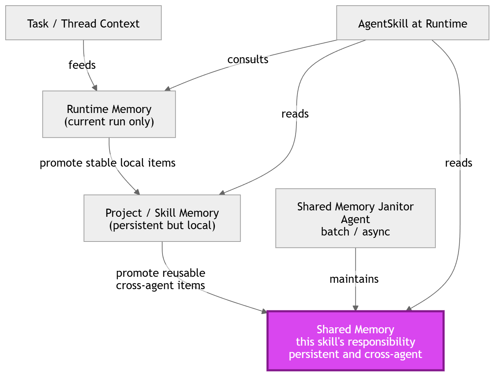
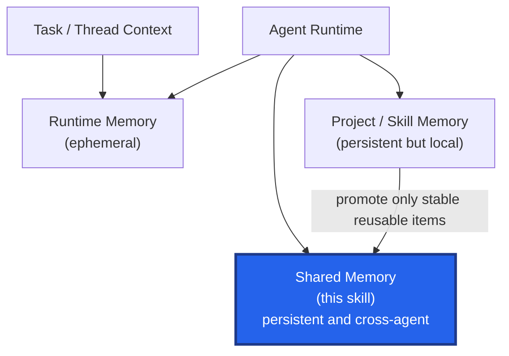

# Shared Memory Skill

`shared-memory` is an Agent Skill for deliberate, auditable cross-agent memory.

It gives agents a narrow, explicit way to assess, retrieve, validate, write, and deprecate durable knowledge that should be reused across multiple agents, skills, or repositories. It is intentionally not a general memory system, a task scratchpad, or a place to hide project-local facts.


## What This Repository Does

This repository implements the shared layer in a three-layer memory model:

| Layer | Scope | Persistence | Managed Here |
| --- | --- | --- | --- |
| Runtime memory | Current task or thread | Ephemeral | No |
| Project / skill memory | One repository, project, or skill | Persistent but local | No |
| Shared memory | Multiple agents, skills, or repositories | Persistent and cross-agent | Yes |

The skill exists to keep that boundary crisp. Shared memory should stay trustworthy, sparse, and reusable.

## What This Repository Does Not Do

This skill does not manage:

- task-local notes or plans
- project-local persistent memory
- secrets or private operational data
- autonomous self-modifying memory behavior
- broad enterprise knowledge infrastructure beyond the shared-store contract

Those are related concerns, but they remain outside the scope of this repository by design.

## Why It Exists

Agent work often spans long threads, multiple sessions, and more than one repository. Without a durable shared layer, agents repeatedly rediscover the same cross-cutting conventions and preferences.

This skill solves that specific problem by providing:

- a clear promotion boundary
- a deterministic CLI for interacting with the store
- a versioned schema with validation
- an auditable deprecation model instead of deletion
- tests and evaluation artifacts for maintainers

## Repository Layout

- `SKILL.md`: agent-facing contract and workflow
- `agents/openai.yaml`: UI-facing metadata for skill catalogs
- `scripts/manage_memory.py`: supported CLI for assessment, reads, writes, deprecations, and validation
- `references/promotion-guide.md`: guidance for deciding what belongs in shared memory
- `references/schema.md`: canonical schema and CLI response contract
- `assets/shared-memory-template.json`: example store
- `evals/shared-memory-cases.json`: boundary evaluation cases
- `tests/`: CLI and repository contract tests

## Installation

1. Place this folder in your skill directory.
2. Ensure Python 3.9+ is available.
3. Optionally set `AGENT_SHARED_MEMORY_PATH` if you do not want to use the default store path `~/.agent_shared_memory.json`.

The skill is self-contained. `SKILL.md` is the agent entry point, and `scripts/manage_memory.py` is the only supported interface for modifying the store.

## Operating Model

The intended workflow is deliberate promotion, not indiscriminate retention:

1. Assess whether a candidate belongs in shared memory at all.
2. Search and read existing topics before writing.
3. Write only stable, context-independent knowledge with a meaningful confidence score.
4. Deprecate outdated guidance instead of deleting it.
5. Validate the store when in doubt.

This keeps the shared layer useful instead of turning it into a noisy second wiki.

## Quick Start

Assess whether a candidate belongs in shared memory:

```bash
python scripts/manage_memory.py assess \
  --candidate "Use Conventional Commits across shared repositories unless a local guide overrides them." \
  --scope cross-agent \
  --stability stable \
  --sensitivity internal \
  --context-independent yes \
  --format json
```

List existing topics:

```bash
python scripts/manage_memory.py list-topics --format json
```

Search for a relevant topic before writing:

```bash
python scripts/manage_memory.py search --query "commit convention" --format json
```

Read a topic:

```bash
python scripts/manage_memory.py read --topic "CommitConventions" --format json
```

Write a durable cross-agent convention:

```bash
python scripts/manage_memory.py write \
  --topic "CommitConventions" \
  --content "Use Conventional Commits across shared repositories unless a repository-specific guide overrides them." \
  --source "Codex" \
  --confidence 0.95 \
  --tags "git,conventions" \
  --evidence "Observed across shared engineering guidance and multiple repositories." \
  --format json
```

Deprecate an outdated entry:

```bash
python scripts/manage_memory.py deprecate \
  --topic "CommitConventions" \
  --id 3 \
  --reason "Superseded by the updated shared engineering standard." \
  --format json
```

Validate the store:

```bash
python scripts/manage_memory.py validate --format json
```

## CLI Commands

Supported commands:

- `assess`
- `list-topics`
- `search`
- `read`
- `write`
- `deprecate`
- `validate`

The CLI is designed for agentic use first:

- JSON is the default stdout format.
- Diagnostics go to stderr.
- Writes are atomic.
- Legacy flat stores are normalized on read.
- Deprecated entries remain in the audit trail.
- Exact active duplicates within a topic are blocked by default.

Run `python scripts/manage_memory.py <command> --help` for full flags.

## Shared-Memory Decision Rules

Promote information into shared memory only when all of the following are true:

1. It is useful beyond the current task.
2. It applies across multiple agents, skills, or repositories.
3. Another agent can use it without hidden local context.
4. It is stable enough to survive beyond the current task.
5. It contains no secrets, credentials, private data, or customer data.

If the candidate is:

- task-local, keep it in runtime memory
- persistent but repo-local, keep it in project / skill memory
- sensitive, unstable, or speculative, reject it

## Store Contract

The store uses a versioned JSON schema:

```json
{
  "schema_version": "2.0",
  "topics": {
    "CommitConventions": [
      {
        "id": 1,
        "status": "active",
        "created_at": "2026-03-18T10:00:00Z",
        "source": "Codex",
        "confidence": 0.95,
        "content": "Use Conventional Commits across shared repositories unless a repository-specific guide overrides them.",
        "tags": ["git", "conventions"],
        "evidence": "Observed in shared engineering guidance."
      }
    ]
  }
}
```

See [references/schema.md](./references/schema.md) for field definitions, validation rules, and the command output contract.

## Example Good Entries

- Cross-repository engineering conventions
- Shared documentation or review preferences
- Reusable prompt patterns that apply beyond one codebase
- Organization-wide defaults and guardrails

## Example Rejections

- Current task notes
- Intermediate reasoning
- Repository-specific paths or setup facts
- Secrets, credentials, or private data
- Guesses, rumors, or low-confidence observations

## Conceptual Architecture

The diagram below shows the relationship between task context, local persistence, and the shared-memory layer managed by this skill.





## Evaluation And Testing

This repository includes two validation layers:

- `tests/test_manage_memory.py`: CLI regression coverage
- `tests/test_repository_contract.py`: packaging and contract checks for `SKILL.md`, `agents/openai.yaml`, and eval artifacts

It also includes prompt-style boundary cases in [`evals/shared-memory-cases.json`](./evals/shared-memory-cases.json).

Recommended maintenance loop:

1. Update the skill or CLI.
2. Run `python -m unittest discover -s tests`.
3. Review and extend `evals/shared-memory-cases.json` when boundaries or workflows change.
4. Update the docs and changelog for any externally visible behavior change.

## Optional Integrations

The following are compatible with this repository but intentionally out of scope for the current implementation:

- a janitor or curator workflow for periodic cleanup
- alternate backing stores such as SQLite or a service layer
- organization-specific approval workflows around promotion

Those should remain integrations around the core skill, not coupled into the minimal shared-memory contract.

## Contributing

Favor changes that improve clarity, boundary safety, and deterministic behavior without expanding scope unnecessarily.

When contributing:

- keep `SKILL.md` concise and agent-first
- keep cross-agent and repo-local memory concerns separate
- prefer auditable CLI behavior over fuzzy implicit logic
- add or update tests when CLI behavior or repository contracts change

## License

MIT. See [LICENSE](./LICENSE).
